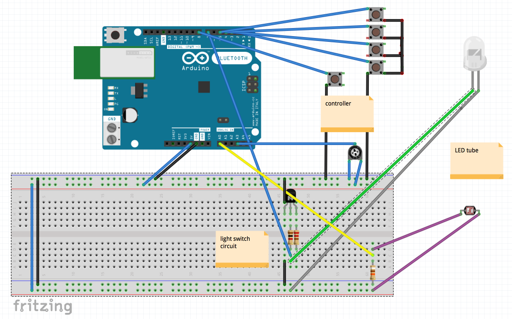

# IDD - HW3
Paige Plander - electrical and max
Cameron Riley - enclosures and design

### Control Scheme 
Our control scheme involves a photocell mounted below an illuminated test tube of color dyed water. To adjust the resitive value of the photocell, we attached a syringe to the tube to increase and decrease the amount of liquid above the photocell. By attaching an LED at the top of the tube, we were able to detect value changes along the entire length of the tube, so only one photocell was necessary. The voltage values measured across the photocell are mapped to frequency in our instrument (more liquid = lower frequency). 

The 4 red buttons on the instrument controller adjust the pitch based off the base frequency set by the liquid height, to allow for creating quick melodies. A potentiometer adjusts the amplitude of the audio wave (volume). A button on the opposite side of the enclosure is used to sustain and stop the current note. 

### Hardware Implementation
The enclosure for the tube was laser cut to fit the test tube, photocell, and LED, in a way that made it easy to interchange the test tube. The controller enclosure fit the circuitry for the 5 control buttons and potentiometer. 

Below is a very crude circuit diagram of our design.

### Software Implementation
All of the data from the Arduino was passed into (Max)[https://cycling74.com/products/max/] to generate the audio. The frequency adjusting buttons were registered as chorded key values, and then parsed in Max. To determine what note should be played, the Max patch first takes the reading from the photocell (ported in as an analog reading), converts it to the nearest midi note, then adds a midi number between 1 and 7, depending on which frequency button was pressed. The sustain button is read as a digital input, and is used as a multiplier to let or prevent the note from being played. 

### Reflection
tired
